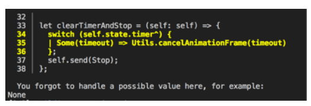
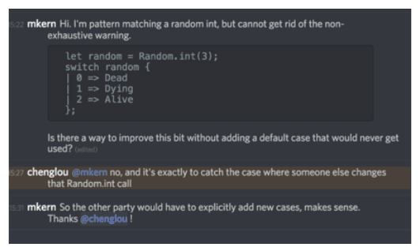
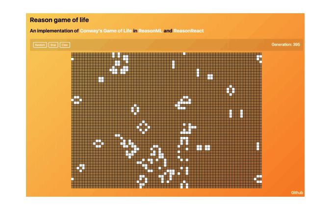
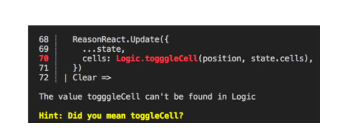

# 通过实例学习ReasonML

ReasonML 是针对现代 Web 开发的 OCaml 语言的新方言。这篇学士论文的目的是探讨语言的承诺和核心范式。其目的也在于评价其可接近性和可用性。

探讨了与 ReasonML 相关的 Web 开发和函数式编程的背景。详细阐述了 ReasonML 的语法和功能。 为了研究和评估语言，创建了一个互动游戏。 该游戏是 Conway 的生命游戏的实现。

演示项目已成功创建，没有重大问题。 ReasonML 的静态类型系统和编译器消息被评估为有用。语言的语法被确定为 JavaScript 开发人员易于学习。 考虑到这一点被认为适合于构建这些类型的应用程序。

关键词：

JavaScript, ReasonML, OCaml, Client-Side, Web Development, Front-End

## 前言

完成的项目可以在线查看。 最好在具有现代网络浏览器的台式计算机上查看，例如Google Chrome或Mozilla Firefox。

演示项目的源代码存储库也可以在GitHub网站上公开在线获取，并且可以在阅读时运行和跟踪。

ReasonML主题只有少数资源，它们都在线。 该主题的第一本书，Axel Rauschmayer 博士的“探索 ReasonML 和函数式编程”仍在进行中，可以在线阅读。这项工作中的许多知识也来自官方文档。

作者要感谢论文主管 Janne Kumpuoja，ReasonML 贡献者和社区。 特别感谢 Reason-Conf 2018 的组织者。

Helsinki, 21.05.2018

Matthias Kern


## 内容

- 抽象
- 前言
- 内容
- 词汇
- 1 介绍
- 2 背景
    - 2.1 web 开发
    - 2.2 函数式编程
- 3 REASONML
    - 3.1 基本信息和历史
    - 3.2 模块
    - 3.3 变体类型
    - 3.4 模式匹配
    - 3.5 与 JS 和 OCaml 的交互
    - 3.6 与 OCaml 的差异
    - 3.7 与纯函数语言的比较
- 4 演示
    - 4.1 开发过程
    - 4.2 类型
    - 4.3 状态管理和 React
    - 4.4 函数式编程模式
    - 4.5 结果
    - 4.6 备注
    - 4.7 进一步的步骤
- 5 结论并展望未来
- 参考
- 附录

## 词汇

- API：应用程序编程接口
- bs：BuckleScript包前缀
- CSS：级联样式表
- DOM：文档对象模型
- GCD：最大的公约数
- HTML：超文本标记语言
- JS：JavaScript
- JSX：JavaScript XML
- NPM：节点包管理器，JavaScript的包管理器
- WebGL：基于OpenGL的Web Graphics API
- XML：可扩展标记语言

## 介绍

ReasonML 是一种相对较新的编程语言，它皆在于将系统语言 OCaml 的功能和生态系统与主要以 Web 为中心的语言 JavaScript 结合在一起。作者广泛使用并研究了编程语言 JavaScript。他还有使用TypeScript语言的经验。 本论文的重点是探索ReasonML语言，并从作者的语境中对其进行评估。 首先，第二章讨论了Web开发和编程语言中ReasonML的背景和上下文。 在随后的章节中，阐述了语言的特点及其与其他语言的关系。 出于评估的目的，已经使用ReasonML创建了基于Web的交互式游戏。 选择演示项目是为了帮助进行评估，并且已经有了一组预定目标，这些目标在第四章中有详细说明。 最后一章讨论了作者的结论，并提供了对ReasonML未来的看法。论文的主题一般是出于个人对函数式编程和编程语言的兴趣而选择的。 作者希望通过对该主题的探索，可以更好地理解编程语言及其特征。 他还希望这篇论文能够为他自己介绍OCaml语言。 在撰写本论文时所学到的技巧和见解有望在作者软件工程师的职业生涯后期得到帮助。

## 背景

本章旨在概述本论文的背景和工作。它应该提供对JavaScript应用程序和函数式编程编程背景的深入了解。

### web 开发

Web开发涵盖了为生成网站而执行的所有工作。它涉及各个行业，涉及范围从简单的静态页面到非常接近本机桌面应用程序的更复杂的应用程序。随着更复杂和资源密集型应用程序的开发在浏览器中运行并且代码库也在不断增长，对高性能但同时可管理代码的需求也在不断增加。对于客户端Web开发，也称为“前端”，传统堆栈包括用于创建站点标记的HTML，用于样式的CSS和用于交互脚本的JavaScript。传统上，该领域中新技术的开发仅限于浏览器提供的固定约束以及保持向后兼容的需要。为了能够在常用浏览器中使用高级甚至未发布的功能之前，工程师一直致力于编译器。例如，这些编译器可以将超集SASS转换为兼容的CSS。

对于传统的服务器呈现网站，开发人员能够使用他们在后端首选的任何技术堆栈。 近年来，在JavaScript中创建所谓的客户端Web应用程序的方法已经获得了很多人的欢迎。 JavaScript是一种无类型语言，并不通过浏览器解释器提供运行时类型安全性。 这一事实导致工程师致力于将静态类型检查引入语言。 一个例子是Google Closure Compiler，它从JSDoc格式提供的注释中派生类型。 （1）稍后，创建了包含类型声明的JavaScript超集，例如Typescript或Flow。 这些工具的类型检查的严格程度取决于相应工具的配置以及用户在源代码中使用类型的强度。 强制执行更强类型检查但是更高级别抽象的语言例如是PureScript，ClojureScript或Elm。

### 函数式编程

不同的编程语言以不同的方式采用了函数式编程。 然而，范式的核心概念是纯函数，其行为类似于数学方程和不可变数据结构。 术语“纯”描述了每次调用时都会产生相同结果的相同结果的函数。 它们也不会改变功能范围之外的状态或产生所谓的“副作用”。 这样可以提供更好的可测试性和可读性，因为理论上，每个纯函数都可以在没有上下文的情况下进行测试和读取。 因此，函数也可以很容易地组合，这是函数式编程范例中另一种常用的技术。不可变的相反是可变的，这意味着能够直接改变或改变一个值。 而是，创建值的克隆，并应用更改。 支持函数式编程的语言包括Scheme，Erlang，Haskell，OCaml和ReasonML。

JavaScript被设计为具有类似C的语法作为Java，并且很长一段时间，通常使用类似于面向对象编程技术的方法。 自ECMAScript版本5以来，新的语言特性已添加到核心语言规范中，以便在Array原型对象上启用函数编程，例如map，filter或reduce函数。 （2）2015年，版本6引入了箭头功能和其他功能，以改善对象的不可变使用。 （3）库，例如 Ramda或Lodash已被用于帮助处理数据或以函数式编写算法。现代客户端库（如Angular或React）已经能够展示使用不可变数据和纯函数的性能优势。 由于这些发展以及开发人员编写可读，运行良好且可维护的代码的强烈愿望，函数式编程已经找到了大量Web开发人员的方式

## REASONML

在下一章中，将描述 ReasonML 的历史和特征。随后，语言在函数式编程的上下文中进行描述。

### 基本信息和历史

事实上，ReasonML并不是一种全新的语言，而是语言OCaml之上的语法。 OCaml是一种“工业强度编程语言”，并且根据官方网站支持“功能，命令和面向对象的风格”。（4）OCaml具有强大的语言功能，静态类型系统也能够进行类型推断。 OCaml可以与ML风格的语言系列相关联。这些所谓的“元语言”对于处理和处理其他语言以及通常的树型结构非常有用。它们也用于编写编译器或静态分析器。 但是，它们在Web开发中的广泛使用并不为人所知。

Jordan Walke，发明者或React，可以说是在撰写本文时与DOM交互的最受欢迎的客户端库之一，它早期使用SML进行原型化，这是一种与OCaml相对接近的语言。在创建Reason的公司Facebook上，OCaml已经使用了几年，例如Flow静态类型检查器已用OCaml编写。 （5）在React 开始流行之后，Jordan Walke 和 Cheng Lou 回到了最初的实现，并开始迭代 Reason 及其语法，目的是在 JavaScript 和 OCaml 之间建立一个桥梁。 （6）强大的互操作性和熟悉的，更友好的语法，使得 JavaScript 开发人员可以访问 OCaml 的优势和生态系统，被命名为该项目的一些主要目标。 （7）。据 Jordan Walke 所说，ReasonML“解决了我在过去五年中构建 UI 应用程序时遇到的最大问题”，“简而言之，这是将 React 提升到新水平的最佳方式”。 （8）

### 模块

在Reason中，每个文件都是一个模块。 原始编译器BuckleScript默认选择目标目录中的所有Reason文件。 目录中的所有.re文件都可以从其Module命名空间下的其他代码中立即访问。也可以使用Module关键字在其他模块中嵌套创建模块。默认情况下，模块的所有字段都是公开的，但是有一个选项可以显式 使用.rei签名文件定义其公共API。 为了简化模块的使用，可以通过open关键字“打开”它们，使其功能在当前的块语句中可用。 它们也可以在表达式中内联打开，以使源代码更清晰，更简洁。 图1显示了Array模块中make和map函数的内联使用示例。

```ocaml
Array.(make(cols, None) |> make(rows) |> map(map(fn)));
```
> 图1.内联模块打开示例

### 变体类型

JavaScript是一种动态类型语言，它允许隐式强制，类型从一个到另一个的转换，这导致了许多与语言相关的怨恨。 变量也可以保存null或undefined的值，这是实现此概念的任何语言中无数错误的来源。 null引用的发明者ony Hoarse将这个概念称为“历史上一个坏主意”（9）

Reason 承诺强大的类型推理和表达力与强大的功能称为变体。 变体类型与Cstyle语言中的Enum类型共享相似性。 变体由类型构造函数组成。 这些符号可以包含参数，因此可以用于语义显示动态值和状态，如图2所示，其中类型 fruit 是Apple或Orange类型。

```ocaml
type fruit =
    | Apple
    | Orange;
```
> 图2.变体类型的示例用法

如果想要扩展或重用它们，则存在多态变体，它们可能在多个变体中使用相同类型的构造函数（10）。 多态变体还允许使用泛型和变量类型。

### 模式匹配

变体启用另一个称为模式匹配的强大功能。 Reason并不是第一种使用这个概念的语言，甚至还有一个关于正在讨论的JavaScript标准的补充建议。（11）

变体的另一个示例是语言中内置的选项类型。 它借助于 Some (参数)和 None 类型构造函数强制区分未初始化或“空”和初始化值。 图3显示了具有模式匹配的类型的示例用法。

```ocaml
type child = option(int);

let bornChild = child =>
switch (child) {
    | Some(age) => age
    | None => 0
}
```
> 图3.选项变体类型的示例用法

乍一看，switch语句看起来很熟悉，似乎与JavaScript中的类似。但是，Reason等价物不仅适用于原始值，还适用于类型构造函数和复杂绑定，例如元组，列表甚至异常。还有所谓的类型


警卫可以在分支机构内部提供更复杂的条件。结合从语句中绑定返回值的能力，模式匹配消除了对C风格语言中频繁模式的需求：几个if / else子句相互跟随。 if / else模式已经显示出一个常见的错误来源，其中值会因行为不当导致错误的分支，或者因为它们被遗忘的边缘情况。当switch语句与所有情况都不匹配时，ReasonML编译器会警告开发人员，以防止不确定的错误状态，即使这与写入更多代码一致（图4）。其中一位核心开发人员将此行为解释为明确的设计决策，以提前预防错误（图5）。


> 图4.选项的非详尽模式匹配的编译器警告


> 图5.关于Cheng Lou（Facebook）的非详尽模式匹配的聊天对话的屏幕截图

### 与JS和OCaml的交互

列为 Reason 项目的其他目标是与现有代码的兼容性和互操作性。 BuckleScript 利用 OCaml 的宏编程功能来处理代码中特定装饰器的这些外部函数接口。 （12）借助这些宏，NPM 中的现有模块和浏览器实现的接口可以在 Reason 代码中使用相对类型安全。 然后压力点在于这些绑定是正确的，这一方面需要知道被包裹的代码，但另一方面迫使人们仔细考虑类型。 OCaml 代码可以与 Reason 模块一样使用，但需要仔细使用，因为某些模块可能包含在浏览器内无法工作的本机模块。

### 与OCaml的差异

Reason语法已被大量迭代，并且仍在进行中。 目前这项工作中使用的版本是3.1.0。

为了吸引并使JS开发人员的过渡变得更容易，致力于Reason的工程师已经删除了一些OCaml的语法特征，这些特性特别不同，并且将其他语法特性调整为更接近JavaScript的C风格语法。 普通函数使用=> lambda表示法编写，这种语法已添加到最新版本的JavaScript中，通常也称为“箭头”函数。 相反，OCaml有几种不同的方式来指定相同的功能，对于没有ML风格语言经验的用户来说，这可能不太直观。

Reason区分两种类型的相等：结构，意味着比较绑定的内容是相同的和引用的，这意味着它们引用相同的绑定。 表1显示相应的运算符已被调整为使用与JavaScript中相同数量的符号，即使它们不以完全相似的方式工作（JavaScript区分松散和严格的质量）。

对于结构不等式比较，语法已被调整为使用感叹号，通常是布尔值不，在 C-Style 语法中，OCaml 使用 != 来取消引用它们原始的绑定（表2）

表1. OCaml和ReasonML中的相等运算符的比较（13）

| Equality | OCaml | Reason |
|---------|-----------|------|
|Structural| x = y | x == y  |
|Referential | x==y | x ===y |

表2. OCaml和ReasonML中不等式运算符的比较（13）

| Inequality | OCaml | Reason |
|---------|-----------|------|
|Structural| x <> y | x != y  |
|Referential | x != y | x !== y |

在图6中，使用Reason的最大公约数算法的示例实现与图7中的OCaml等价物一起可见。该示例取自ReasonML Playground。 （14）很明显，模式匹配已被调整为更像JavaScript的switch语句。在函数参数周围添加了一些元素，它们看起来也像JS等价物。 命令式日志记录表达式在合理范围内绑定到返回值。 ReasonML反而允许忽略它。 这种调整对于使用命令式for或while循环似乎特别有用。 Ocaml也不使用 => 运算符进行函数声明，并使用单箭头 ->匹配情况。

```ocaml
let rec gcd = (a, b) =>
switch (a mod b) {
| 0 => b
| r => gcd(b, r)
};

Js.log(gcd(27, 9));
```
> 图6. ReasonML中的GCD计算

```ocaml
let rec gcd a b =
    match a mod b with
    | 0 -> b
    | r -> gcd b r

let _ = Js.log (gcd 27 9)
```
> 图7. OCaml中的GCD计算

### 与纯函数语言的比较

OCaml，以及ReasonML，并不是纯粹的函数式。 它的主要重点是启用表达性和声明性代码，它允许开发人员在不同的编程风格和技术之间进行混合和匹配。 该语言有必要的陈述，例如 for循环，但也是使用函数式范例获得相同结果的替代方案，例如 递归函数或高阶函数。 这与例如 Haskell，一种纯函数式语言。 Haskell也是静态类型的。 它有类型推断，但它有一种完全不同的方式允许命令式编程和副作用。 例如，在Haskell中根本不存在for或while循环。

## 演示

演示项目的目的是介绍语言并对其进行评估。 为此，创建了一个交互式网站，其中嵌入了一个细胞自动机游戏的版本。 生命游戏的概念由John Conway于1970年出版。 （15）细胞的状态为活着或死亡。 细胞可以存活或死亡，具体取决于其邻居的状态。 根据他们的初始位置，细胞可能形成在整个游戏中发展的模式。 选择游戏是因为它需要一些有助于评估ReasonML的重要概念。 这些需求包括例如 迭代数据，生成随机数据，状态管理或递归函数。 作为演示项目的实现目标，以下用户故事来自在线挑战（16）：

- “当我第一次到达游戏时，它将随机生成一个棋盘并开始游戏。”
- “我可以开始和停止面板。”
- “我可以设置面板。”
- “我可以清除面板。”
- “当我按下开始时，游戏就会播出。”
- “每次面板改变，我都能看到已经过了多少代人。”
- “游戏应该遵循生命游戏的规则。”

该项目在麻省理工学院获得许可，可以在附录4中找到。


### 开发过程

该项目使用BucksScript通过bs-platform NPM包将Reason代码编译为JavaScript。 Webpack用于将生成的文件捆绑到从HTML索引页引用的单个文件中。 此文件以及包含样式的CSS文件可以在附录2中找到.BucksScript和Webpack是使用package.json文件中的NPM脚本配置和执行的。 这些工具的配置如附录3所示。

Reason开发工具可以通过reason-cli软件包安装，该软件包提供refmt代码格式化工具以及编辑器完成提供程序Merlin。 BuckleScript和Merlin都可以在编译器输出和使用的文本编辑器中提供类型注释，警告和错误。

由于Reason与React有直接关系，因此它也具有第一手React支持。因此，作者决定使用ReasonReact模块。 React使用一个名为JSX的抽象，它具有类似XML的语法来描述组件和DOM元素。 ReasonReact在处理JSX方面与JS等价物有几点不同，但这对本论文并不重要。 原因源代码，但不是生成的JavaScript，可以在附录1中找到。

### 类型

作者通常选择使用显式类型来注释大多数函数，因为他不习惯强推理能力。编译器可能会渲染大多数这些注释不必要。注释可以帮助强制执行并使类型显式化。静态类型的有用性在重构或移动代码时显露出来。在编译器没有发出错误消息时，作者可以确保应用程序的其他未触及部分仍然完好无损。


在检查BuckleScript生成的文件时，很明显编译器正在将原始特定类型编译为JavaScript原语。在图8中，可以看到方法cycleCell的输出代码，注释带有显示原始类型名称的注释。图9显示了原始的Reason实现。模式匹配语句被编译为普通的if语句。单元格记录被编译为数组，状态类型被编译为数字。可以将ReasonML记录编译为JavaScript中的对象，但由于没有其他方依赖于代码的形状，因此在这种情况下编译器输出的形状无关紧要。即使结构被修改了很多，但由于良好的格式化，保留的命名和添加的注释，代码仍然可读。


> 图8. cycleCell函数的BuckleScript输出

```ocaml
let cycleCell = cell =>
switch (cell.status) {
| Alive => {status: Dead}
| Dead => {status: Alive}
};
```
> 图9.切换单元状态的reason代码

### 状态管理和 React

React使用所谓的组件作为用户界面中的建模单元。 在Reason中，每个组件都应位于其自己的模块中，并且在此项目中，每个组件都位于具有相同名称的文件中。

在演示应用程序中，所有应用程序状态都在App组件中处理，该组件传递状态记录并提供发送功能以通过操作触发状态更改。 这个组件是一个所谓的reducer组件，它传递一个初始状态，并有一个带有state和action参数的reducer方法，它们处理状态的更新。 这种模式在React生态系统中随着状态管理库Redux而变得流行。 （17）但是在ReasonReact中，此模式通过ReasonReact.reducerComponent API提供第一手支持，而无需外部库。 所有状态更改都在名为action的变体类型中定义。 对于他的演示项目，这包括通过控件的所有用户交互（图10）。


```ocaml
type action =
    | Evolution
    | Start
    | Stop
    | Clear
    | ToggleCell(position)
    | Random;
```
> 图10.操作变体类型的屏幕截图

通过调用 ReasonReact.Update 在 reducer 函数内部发生对状态的更新。图11显示了 Evolution 操作的示例处理。 作者起初看起来很奇怪，这个函数的返回类型没有状态的返回类型，因为它返回一个新状态，而是一个 ReasonReact.update 的变体。 在查看不同的情况时，很明显它用于区分函数是否触发更新，不更新或副作用。

```ocaml
| Evolution =>
    ReasonReact.Update({
        ...state,
        cells: Logic.evolution(state.cells),
        generation: state.generation + 1,
    })
```
> 图11. reducer函数内的案例的屏幕截图

ReasonReact API是声明性的，可供以前在JavaScript中使用过React库的人访问。 reducer组件模型似乎很有用，因为它取消了对外部状态管理库的需求，而OCaml的模式匹配和变体类型的组合似乎是一个很好的组合。

### 函数式编程模式

除了使用可变的 let 绑定之外，演示程序使用不可变数据结构。 ref 关键字用于将从 requestAnimationFrame 返回的 id 保存到稍后可以取消它的状态。在这种情况下，选择退出不可变状态似乎更容易，因为它是一种副作用，并且无法以纯粹的功能方式进行处理。特别是，为了产生可以在 Logic.re 中看到的游戏的下一个状态，该语言似乎是有利的。游戏板逐个细胞地迭代，以产生下一个细胞进化，这取决于它们的近邻状态。作者在写入映射细胞的函数时遇到了一些问题，因为他已经编写了代码。与以前在 JavaScript 中的样式相同。能够利用管道操作员 |> 制作的功能组合更容易达到可理解和可读的形式。函数 mapCells 就是其中的一个例子。作者也可能没有在 JavaScript 中使用尽可能多的函数组合，并且会创建更多的中间变量。一个示例是前面图1所示，其中 Array 模块的功能用于创建单元矩阵并将函数 fn 应用于结果。

### 结果

最终，实现了所有实施目标。 图12显示了运行演示的屏幕截图。 游戏板顶部可以看到控件“随机”，“开始”，“清除”以及当前一代。 在右上角，显示当前一代的游戏状态。


> 图12.正在运行的演示项目的屏幕截图

作者花了一段时间才熟悉语法的一些细节，即。 何时使用逗号运算符。 创作者为具有JavaScript背景的开发人员进行转换的努力似乎已经成功。 作者特别满意编译器如何通过有用的错误消息简化重构以及初始项目设置的简单性。 快速编译时间和短反馈循环有助于实现良好的开发体验。 花费很少的时间来搜索错误，错误消息通常很有用，甚至暗示可能的解决方案。 （图13）。


> 图13.未找到值的错误消息的屏幕截图

在此工作的过程中，发布了ReasonReact库的0.4.0版本。 升级到新版本是无缝的，没有手动重构工作，因为有一个升级脚本可用于从旧API迁移到新API。（18）

### 进一步的步骤

为了获得更好的渲染性能，程序可以使用一个称为重新处理的外部库，它可以渲染到WebGL或OpenGL而不是DOM。在bsb-native项目的帮助下，可以交叉编译并嵌入本机和移动设备中。 应用。 可以重构某些函数以提高性能并更好地利用内置API。 他们还可以使用新的BuckleScript标准库Belt。 为了在重构时提高安全性，可以使用bs-jest库实现测试。


## 结论和展望未来

在实施游戏时，作者了解了ReasonML语言和生态系统的一些优点和缺点。 设置演示项目很简单，经过一段小小的初始阶段后，语法变得熟悉。从初学者的角度来看，OCaml的语法似乎无法接近，而ReasonML正试图实现相反的目标。 开发人员专注于尽可能简单地从JavaScript过渡是显而易见的。

进入函数式编程范式并不总是微不足道，但Reason的实用方法和精心设计的语法是有利的。强类型系统通常比限制更具权力。 语义变体和模式匹配以及类型注释使得程序易于推理。

快速而有用的编译器和编辑器反馈也带来了比作者之前在Web应用程序项目中经历的更好的开发人员体验。 Remarkable也是内置的格式化工具，显然也被用于为Reason升级进行自动语法转换，例如： 从版本2到版本3.文档是平易近人和有用的，特别是官方聊天频道是一个很好的资源来询问和学习。 只有深入了解BuckleScript API时，事情才变得令人困惑，但这并不是为了这个项目所必需的。 该项目也不必与OCaml本机模块进行交互。

展望未来，Reason正在获得与JavaScript承诺兼容的更好的异步代码支持以及一个名为Belt的新标准库。 在浏览器中，调试也将通过Bucklescript中的专用调试模式得到改进。

OCaml和Reason的元编程方面似乎非常有用，即使演示项目没有直接使用这些功能。 通过名为PPX的功能，可以进行用户定义的语法扩展或第一类代码生成。 这些本质上是占位符，可以被外部工具覆盖。 已有库使用此功能，例如嵌入GraphQL数据查询语言。

在OCaml的地平线上存在模块化的含义，这可能允许使用ad-hoc多态性。 这将允许例如 使用相同的运算符进行整数和浮点数学运算，而不是，因为最初可能会对新手造成混淆，不得不使用例如 +和+。 或/和/。。 在OCaml的基础上，通过多核使用也支持并发和并行。

作者能够观察到来自Reason的真实用户的批评，他们经常提到BuckleScript API很难掌握，并且对较大库的绑定很难正确编写。 另一条评论涉及Reason JS Promise API。

在该演示项目的有限范围内，作者没有遇到任何重大问题或者没有受到语言本身的限制。 随着更广泛的采用和实际使用，这些问题将有望得到解决和克服。 在这种印象下，看到作者采用这种语言是多么简单，他真的可以看到Jordan Walke的愿望成为现实。Reason 可以将React甚至Web开发提升到一个新的水平。


#### 参考

- 1.GitHub. 2018. Annotating JavaScript for the Closure Compiler. Date of retrieval 19.05.2018.  https://github.com/google/closure-compiler/wiki/Annotating-JavaScriptfor-the-Closure-Compiler
- 2.ECMA International. 2011. ECMA-262 Edition 5.1, The ECMAScript Language Specification. Date of Retrieval 06.05.2018.  https://www.ecma-international.org/ecma-262/5.1/#sec-15.4.4.19
- 3.ECMA International. 2011. ECMA-262 6th Edition, The ECMAScript 2015 Language Specification. Date of Retrieval 06.05.2018.  https://www.ecma-international.org/ecma-262/6.0/#sec-arrow-functiondefinitions
- 4.OCaml.org, 2018. OCaml. Date of retrieval 04.05.2018.  http://ocaml.org/
- 5.GitHub. 2018. Flow. Date of retrieval 18.05.2018.  https://github.com/facebook/flow
- 6.Reactiflux. 2017. Cheng Lou. Date of retrieval 05.05.2018.  https://www.reactiflux.com/transcripts/cheng-lou/
- 7.Reason. 2018. What and Why. Date of retrieval 06.05.2018.  https://reasonml.github.io/docs/en/what-and-why.html
- 8.Reactiflux. 2017. Jordan Walke. Date of retrieval 05.05.2018.  https://www.reactiflux.com/transcripts/jordan-walke/
- 9.Hoare, Tony. 2009. Null References: The Billion Dollar Mistake.  Date of retrieval 05.05.2018.  https://www.infoq.com/presentations/Null-References-The-Billion-DollarMistake-Tony-Hoare
- 10.Rauschmayer, A. 2018. Polymorphic variants.  Date of retrieval 06.05.2018.  http://reasonmlhub.com/exploring-reasonml/ch_polymorphic-variants.html
- 11.GitHub. 2018. ECMAScript Pattern Matching.  Date of retrieval 05.05.2018.  https://github.com/tc39/proposal-pattern-matching
- 12.Wikipedia. 2018. Foreign function interface. Date of retrieval 06.05.2018.  https://en.wikipedia.org/wiki/Foreign_function_interface
- 13.Reason. 2018. Comparison to OCaml. Date of retrieval 04.05.2018.  https://reasonml.github.io/docs/en/comparison-to-ocaml.html
- 14.Reason. 2018. Playground. Date of retrieval 18.05.2018.  https://reasonml.github.io/en/try.html
- 15.Wikipedia. 2018. Conway’s Game of life. Date of retrieval 08.05.2018.  https://en.wikipedia.org/wiki/Conway's_Game_of_Life
- 16.FreeCodeCamp. 2018. Build the Game of life.  Date of retrieval 05.05.2018.  https://www.freecodecamp.org/challenges/build-the-game-of-life
- 17.Redux. 2018. Read Me. Date of retrieval 18.05.2018.  https://redux.js.org/
- 18.GitHub. 2018. Official ReasonReact Migration Script.  Date of retrieval 18.05.2018.  https://github.com/chenglou/upgrade-reason-react
- 19.GitHub. 2018. Reason-apollo. Date of retrieval 19.05.2018.  https://github.com/apollographql/reason-apollo
- 20.OCaml Labs. 2017. PPX. Date of retrieval 20.05.2018.  http://ocamllabs.io/doc/ppx.html
- 21.White, L. 2015. Modular Implicits. Date of retrieval 20.05.2018.  https://arxiv.org/pdf/1512.01895.pdf
- 22.Rauschmayer, A. 2018. What is planned for ReasonML?.  Date of retrieval 05.05.2018.  http://reasonmlhub.com/exploring-reasonml/ch_future.html
- 23.GitHub. 2018. Multicore OCaml. Date of retrieval 18.05.2018.  https://github.com/ocamllabs/ocaml-multicore

#### 附录

以下附录也可以在 https://github.com/matthiaskern/reason-game-of-life 在线找到。

- 附录1 ReasonML源代码
- 附录2公共源代码
- 附录3项目配置
- 附录4许可

src/SharedTypes.re

```ocaml
type status =
    | Alive
    | Dead;

type cell = {status};

type row = array(cell);

type cells = array(row)

type size = (int, int);

type position = (int, int);
```

src/Logic.re

```ocaml
open SharedTypes;

let getInitialSize = () : size => {
    let width = Utils.viewportWidth;
    width > 992 ? (50, 70) : width > 576 ? (30, 50) : (15, 25);
};

/* 初始化随机模块 */
Random.self init();

let alivePercentile = 8;

let biggerThanAlivePercentile = num => num > alivePercentle;

let randomStatus = ():status => {
    let isAlive = biggerThanAlivePercentile(Random.int(11));
    isAlive ? Alive : Dead;
};

let randomCell = el:cell => {status: randomStatus()};

let deadCell = el:cell => {status: Dead};

let generateCells = (size: size, fn: => cell) : cells => {
    let (rows, cols) = size;
    Array.(make(cols, None) |> make(rows) |> map(map(fn)));
};

let generateEmptyCells = (size: size) => generateCells(size, deadCell);

let generateRandomCells = (size: size) => generateCells(size, randomCell);

let mapCells = (fn: (position, cell, cells) => cell, cells) : cells =>
    Array.(
        mapi((y,row) =>  row |> mapi((x, cell') => fn((x, y), cell', cells)), cells)
    );

let cycleCell = cell : cell => 
switch (cell.status) {
    | Alive => {status: Dead}
    | Dead => {status: Alive}
};

let toggleCel = ((x, y): position) =>
    mapCells(((x', y'), cell, _) =>
        x === x' && y === y' ? cycleCell(cell) : cell);


let correctIndex = (length: int, i: int): int =>
    i === (-1) ? length - 1 : i === length ? 0 : i;

let findeCell = (cells, (x, y): position): cell => {
    let lengthX = Array.length(cells[0]);
    let lengthY = Array.length(cells);
    let x' = correctIndex(lengthX, x);
    let y' = correctIndex(lengthY, y);
    cells[y'][x'];
};

let getNeighborCells = ((x, y):position, cells):list(cell) =>
    [
        (x - 1, y - 1),
        (x - 1, y),
        (x - 1, y + 1),
        (x, y - 1),
        (x, y + 1),
        (x + 1, y - 1),
        (x + 1, y),
        (x + 1, y + 1),

    ]
    |> List.map(findCell(cells));

let getAliveNeigbors = (cells, position):int => {
    let neighborCells = getNeighborCells(position, cells);
    neighborCells |> List.filter(({status}) => status == Alive) |> List.length;
};

let checkCell = (position, cell, cells) : cell => {
    let neighbors = getAliveNeighbors(cells, position);
    switch (cell.status) {
    | Alive when neighbors > 3 || neighbors < 2 => {status: Dead}
    | Dead when neighbors == 3 => {status: Alive}
    | _ => cell
    };
};

let evolution = cells : cells => mapCells(checkCell, cells);
```

src/Utils.re

```ocaml
let strE = ReasonReact.string;

[@bs.val]
external requestAnimationFrame : (unit => unit) => int = "requestAnimationFrame";

[@bs.val]
external viewportWidth : int = "document.documentElement.clientWidth";
```

src/App.re

```ocaml
ReactDOMRe.renderToElementWithId(<App />, "root");
```

src/Main.re

```ocaml
open SharedTypes;

type state = {
    size,
    generation: int,
    cells,
    timer: ref(option(int)),
    isPlaying: bool,
};

type action =
    | Evolution
    | Start
    | Stop
    | Clear
    | ToggleCell(position)
    | Random;

let initialSize = Logic.getInitialSize();

let initialState = () => {
    size: initialSize,
    generation: 0,
    cells: Logic.generateRandomCells(initialSize),
    timer: ref(None),
    isPlaying: false,
};

let component = ReasonReact.reducerComponent("App");

type self = ReasonReact.self(state, ReasonReact.noRetainedProps, action);

let clearTimerAndStop = (self: self) => {
    switch (self.state.timer^) {
        | None => ()
        | Some(timeout) => Utils.cannelAnimationFrame(timeout)
    };
    self.send(Stop);
};

let togglePlay = (self: self, _) =>
    if (self.state.isPlaying) {
        clearTimerAndStop(self);
    } else {
        let rec play = () => {
         self.state.timer := Some(Utils.requestAnimationFrame(play));
         self.send(Evolution);
         };
         play();
         self.send(Start);
    };

let make = children => {
    ...component,
    initialState: () => initialState(),
    reducer: (action, state) =>
         switch (action) {
         | Start => ReasonReact.Update({...state, isPlaying: true})
         | Evolution =>
           ReasonReact.Update({
                ...state,
                cells: Logic.evolution(state.cells),
                generation: state.generation + 1,
           })
         | Stop =>
           ReasonReact.Update({...state, isPlaying: false, timer: ref(None)})
         | ToggleCell(position) =>
           ReasonReact.Update({
                ...state,
                cells: Logic.toggleCell(position, state.cells),
           })
         | Clear => 
           ReasonReact.UpdateWithSideEffects(
              {
                    ...state,
                    cells: Logic.generateEmptyCells(initialSize),
                    generation: 0,
              },
              clearTimerAndStop,
            )
         | Random =>
           ReasonReact.UpdateWithSideEffects(
        {
          ...state,
          cells: Logic.generateRandomCells(state.size),
          generation: 0,
        },
        clearTimerAndStop,
      )
         },
         render: self =>
            <main>
               <Header />
               <Controls
                onRandom=(() => self.send(Random))
                onTogglePlay=(togglePlay(self))
                isPlaying=self.state.isPlaying
                onClear=(()=> self.send(Clear))
                generation=self.state.generation
               />
               <Board
                    cells=self.state.cells
                    onToggle=((y, x) => self.send(ToggleCell((x, y))))
               />
               <footer>
                <a href="https://github.com/matthiaskern/reason-game-of-life" style=(ReactDOMRe.Style.make(~float="right", ~fontSize="17px", ())) target="_blank">(Utils.strE("GitHub"))</a>
               </footer>
            </main>,
};
```

src/Header.re

```ocaml
open Utils;

let componet = ReasonReact.statelessComponent("Header");

let make = children => {
    ...componet,
    render: _self => 
        <header>
            <h1> (strE("Reason game of life")) </h1>
            <h2>
                (strE("An implementation of "))
                 <a href="https://en.wikipedia.org/wiki/Conway%27s_Game_of_Life" target="_blank"> (strE("Conway's Game of Life")) </a>
                    (strE(" in "))
                     <a href="https://reasonml.github.io" target="_blank">
                         (strE("ReasonML"))
                 </a>
                 (strE(" and "))
                 <a href="https://reasonml.github.io/reason-react/" target="_blank">
                     (strE("ReasonReact"))
                 </a>
            </h2>
        </header>,
}
```

src/Board.re

```ocaml
open SharedTypes;

let component = ReasonReact.statelessComponent("Board");

let makeCell = (onToggle, x: int, cell) =>
    <Cell key=(string_of_int(x)) cell onToggle=((_) => onToggle(x)) />;

let make = (~cells: cells, ~onToggle, _childen) => {
    ...component,
    render: _self =>
        <section>
        (
        Array.mapi(
            (y, row) =>
            <div className="row" key=(string_of_int(y))>
            (row |> Array.mapi(makeCell(onToggle(y))) |> ReasonReact.array)
            </div>,
            cells,
            )
            |> ReasonReact.array
        )
        </section>,
}
```

src/Cell.re

```ocaml
open SharedTypes;

type retainedProps = {cell};

let component = ReasonReact.statelessComponentWithRetainedProps("Cell");

let classNameOfStatus = status : string =>
switch (status) {
| Alive => "alive"
| Dead => "dead"
};

let make = (~onToggle, ~cell: cell, _children) => {
    ...component,
    retainedProps: {cell: cell},
    shouldUpdate: ({oldSelf, newSelf}) => oldSelf.remainedProps.cell.status !== newSelf.retainedProps.cell.status,
    render: _self =>
        <div className=("cell " ++ classNameOfStatus(cell.status)) onClick=((_) => onToggle()) />,
};
```

src/Controls.re

```ocaml
open Utils

let component = ReasonReact.statelessComponent("Controls");

let make = (~onRandom, ~onTogglePlay, ~isPlaying, ~onClear, ~generation, _children) => {
    ...component,
    render: _self =>
        <aside>
            <button onClick=((_) => onRandom())> (strE("Random")) </button>
            <button onClick=((_) => onTogglePlay())>
                (strE(isPlaying ? "Stop" : "Start"))
            </button>
            <button onClick=((_) => onClear())> (strE("Clear")) </button>
            <span
            style=(
            ReactDOMRe.Style.make(
                ~float="right",
                ~color="white",
                ~fontSize="17px",
                (),
            )
            )>
            (strE("Generation: " ++ string_of_int(generation)))
            </span>
        </aside>,
};
```

public/index.html

```html
<!DOCTYPE html>
<html lang="en">
<head>
 <meta charset="UTF-8">
 <title>Reason game of life</title>
 <link rel="stylesheet" type="text/css" href="./styles.css">
 <meta name="viewport" content="width=device-width, initialscale=1.0">
</head>
<body>
 <div id="root"></div>
 <script src="./bundle.js"></script>
</body>
</html>
```

public/styles.css

```css
body {
 padding: 0;
 margin: 0;
 font-family: -apple-system, BlinkMacSystemFont, 'Segoe UI', Roboto,
Helvetica, Arial, sans-serif, 'Apple Color Emoji', 'Segoe UI Emoji',
'Segoe UI Symbol';
}
#root {
 display: flex;
 align-items: center;
 justify-content: center;
 background: linear-gradient(135deg, #fad961 0%, #f76b1c 100%);
 height: 100%;
 min-height: 100vh;
}
main {
 display: flex;
 justify-content: space-between;
 flex-direction: column;
 width: 80%;
 height: 80%;
}
main > *{
 margin-top: 0.5rem;
}
aside {
 background-color: rgba(0, 0, 0, 0.1);
 border-radius: 0.25rem;
 padding: 1rem;
}
.row {
 display: flex;
}
.cell {
 font-size: 9px;
 width: 11px;
 height: 11px;
 margin: 0;
}
.cell:not(:last-child) {
 border-right: 1px solid black;
}
.row:not(:first-child) .cell {
 border-top: 1px solid black;
}
.dead {
 background: rgba(65, 65, 65, 0.5);
}
.alive {
 background: white;
}
section {
 display: flex;
 margin-left: 2rem;
 margin-right: 2rem;
 flex-direction: column;
 align-items: center;
}
a {
 color: white;
 text-decoration: none;
 border: 1px solid transparent;
}
a:hover {
 border: 1px dashed white;
}
button {
 background-color: transparent;
 border-width: 1px solid;
 border-color: white;
 border-style: solid;
 padding: 0.25rem 0.5rem;
 color: white;
 border-radius: 0.25rem;
 margin-right: 0.5rem;
 cursor: pointer;
}
button:focus,
button:hover,
button:active{
 border-style: dashed;
}
```

bsconfig.json

```json
{
 "name" : "reason-game-of-life",
 "reason" : {"react-jsx" : 2},
 "bs-dependencies": ["reason-react"],
 "sources": {
 "dir" : "src",
 "subdirs" : true
 },
 "refmt": 3
}
```


webpack.config.js

```js
module.exports = {
 mode: 'development',
 entry: './lib/js/src/Main.js',
 output: {
 path: __dirname + '/public',
 filename: 'bundle.js',
 },
};
```

package.json

```json
{
 "name": "reason-game-of-life",
 "scripts": {
 "start": "bsb -make-world -w",
 "build": "bsb -make-world",
 "bundle": "webpack -w",
 "clean": "bsb -clean-world"
 },
 "version": "1.0.0",
 "license": "MIT",
 "dependencies": {
 "react": "^16.2.0",
 "react-dom": "^16.2.0",
 "reason-react": "^0.4.0"
 },
 "devDependencies": {
 "bs-platform": "^3.0.0",
 "webpack": "^4.1.1",
 "webpack-cli": "^2.0.10"
 }
}
```

License

```text
MIT License
Copyright (c) 2018 Matthias Kern
Permission is hereby granted, free of charge, to any person obtaining
a copy
of this software and associated documentation files (the "Software"),
to deal
in the Software without restriction, including without limitation the
rights
to use, copy, modify, merge, publish, distribute, sublicense, and/or
sell
copies of the Software, and to permit persons to whom the Software is
furnished to do so, subject to the following conditions:
The above copyright notice and this permission notice shall be
included in all
copies or substantial portions of the Software.
THE SOFTWARE IS PROVIDED "AS IS", WITHOUT WARRANTY OF ANY KIND,
EXPRESS OR
IMPLIED, INCLUDING BUT NOT LIMITED TO THE WARRANTIES OF
MERCHANTABILITY,
FITNESS FOR A PARTICULAR PURPOSE AND NONINFRINGEMENT. IN NO EVENT
SHALL THE
AUTHORS OR COPYRIGHT HOLDERS BE LIABLE FOR ANY CLAIM, DAMAGES OR OTHER
LIABILITY, WHETHER IN AN ACTION OF CONTRACT, TORT OR OTHERWISE,
ARISING FROM,
OUT OF OR IN CONNECTION WITH THE SOFTWARE OR THE USE OR OTHER DEALINGS
IN THE
SOFTWARE.
```
